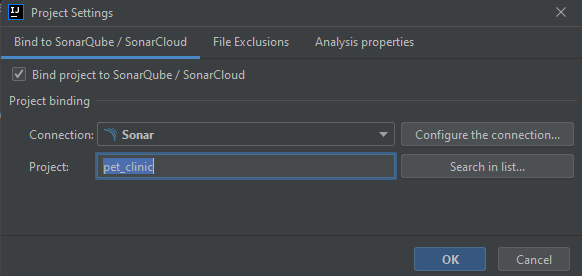

**Table of Contents**

[[_TOC_]]

# Docker Guide
### Start Postgres

To create and start the database enter the following command in the terminal in the root folder of the project

```docker-compose up -d```

To stop service

```docker-compose stop```

Start service

```docker-compose start```

Stop and remove containers

```docker-compose down```

- Our database is available on the local computer under port 5433 and container port 5432
- **Port for test database is 5434.**


# Dao and Service Guide
### How to create Dao and Service for new Entities


1. Each new Dao interface should extend generic interface ReadOnlyDao<K, T> or ReadWriteDao<K, T>. ReadWriteDao interface includes methods from ReadOnlyDao interface.
2. Generic K is key for entity. Generic T is entity. For example: `ExampleDao extends ReadWriteDao<Long, Example>`.
3. Each Dao implementation class should extend generic abstract class ReadOnlyDaoImpl<K,T> or ReadWriteDaoImpl<K, T> and implement their own interface.
4. There are a few simple realization of methods in generic Dao. New methods should be created in Dao interface of current entity.
5. Same rules for Service classes except one thing. Service implementation should create constructor super.

# Lombok Guide
### Use Lombok annotations to generate code
Don't write boilerplate code. Use [Lombok](https://javarush.ru/groups/posts/2753-biblioteka-lombok) annotations to generate it for you.

```
@NoArgsConstructor // Generates constructor that take no arguments.
@AllArgsConstructor // Generates constructor that take one argument per final / non-nullfield.
@RequiredArgsConstructor // Generates constructor that take one argument for every field.
@Getter // Never write public int getFoo() {return foo;} again.
@Setter // Never write setters again.
@EqualsAndHashCode // Generates hashCode and equals implementations from the fields of your object.
@ToString // Generates a toString.
@Data // Combines @ToString, @EqualsAndHashCode, @Getter, @Setter, and @RequiredArgsConstructor
```


# Swagger Guide
### Interact with our APIs using browser
http://localhost:8080/swagger-ui.html

### Generate API documentation based on annotations
Quick and easy way to document your APIs.

[Live demo](http://158.101.164.60:8081/) — see how it works

[Source code](https://github.com/springdoc/springdoc-openapi-demos/blob/master/springdoc-openapi-spring-boot-2-webmvc/src/main/java/org/springdoc/demo/app2/api/UserApi.java) — check what annotations are used


# Integration Test Guide

1. IT class should extend ControllerAbstractIntegrationTest.class
2. IT class should be annotated with @DBRider.
3. Test method should use @DataSet for generation database content.  
4. @DataSet could be with [possible values](https://database-rider.github.io/getting-started/#configuration). 
5. For more information check [official Database Rider documentation](https://database-rider.github.io/database-rider/1.23.0/documentation.html)

# Database Diagram
To change login via google-account petclinic.vet24@gmail.com

Last update 20.05.2021 12:50

https://dbdiagram.io/d/60a62c9db29a09603d15bc72

# Google API Guide
Go to http://localhost:8080/notification in browser to redirect to google auth

Now we just save authorization token for user petclinic.vet24@gmail.com, choose this google account

After success authorization you will be redirect to /hello page

Now you can create, edit, delete event:
1) Create notification in swagger /notification/create to post event in Calendar
- email must be user, whose calendar we want to access(now its only petclinic.vet24@gmail.com)
2) Edit notification in swagger /notification/edit to edit event in Calendar
- we need to add event id, that was received in the response when creating event
3) Delete notification in swagger /notification/delete 
- we need to add event id, that was received in the response when creating event

# Vaadin Guide

For start VaadinPetClinicRunner you should: 
1. Add vaadin/pom.xml file in your current project. 
2. Install [required tools](https://vaadin.com/docs/v14/guide/install). 
3. Reload maven dependencies and type ```npm install``` in the terminal.
4. Run http://localhost:9090 in a browser.

# Sonarqube Guide

Для работы с Sonarqube в Idea нужно подключить плагин Sonarlint.
1. Идём в настройки IDEA и в разделе Plugins находим плагин SonarLint и устанавливаем его.
2. Открываем панель плагина, кликаем по иконке "Configure SonarLint".
3. Далее "Configure the connection...", добавляем новый (SonarQube, не SonarCloud). URL: http://91.241.64.154:9000/
4. Выбираем авторизацию по логину и паролю, вводим данные, которые лежат в карточке gitlab "Аккаунты и ссылки на документацию":
Логин: admin
Пароль: qwertyASDFGH123456
Ok. Finish.
5. Из выпадающего списка выбираем проект "pet_clinic".



Жмём Ok.
6. Если не получилось - гайд с картинками: https://habr.com/ru/company/krista/blog/469963/

# Flyway Guide
Flyway - это инструмент для миграции скриптов в формате sql,
расположенных в pet_clinic\web\src\main\resources\db\migration
В данном случае с их помощью создаются таблицы по всем сущностям базы данных,
что позволит легко создать ту же самую структуру БД при переносе на другой сервер.